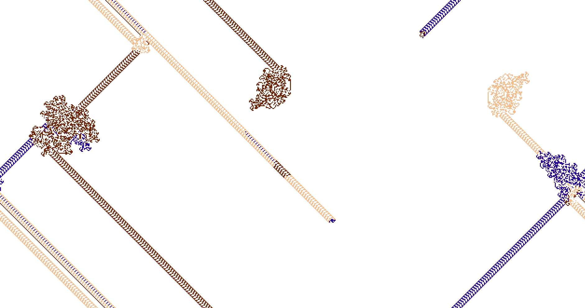

# Langton's Ant
    
#### Inspired by the work of Daniel Shiffman  🌈🚂🚃🚃🚃💚

Langton's Ant principle illustration with some customs.
A click on screen will spawn a new ant.
Langton's ant principle explains that after a certain amount of moves following basic rules, the ant will run away from it's spawn point.
Always repetaing the same pattern

By spawning some new ants, random behaviours can be observed. Some ant, reaching other's path will destroy it and replace the path with their own color.

[Reference](https://en.wikipedia.org/wiki/Langton%27s_ant)

